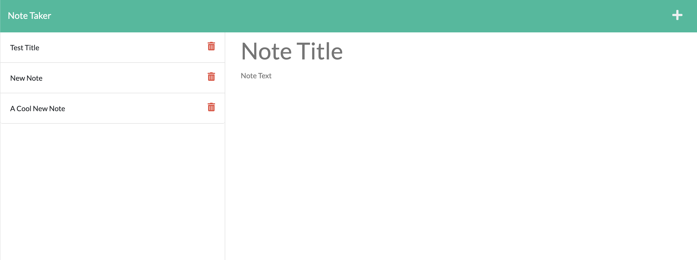

# Note Taker Application

## Description
This application has been built to help user's keep track of anything they need through the development of notes. By using express and fs, a user can use a web interface to write and save notes. To access the site, visit the Heroku application at:
https://blooming-hamlet-47910.herokuapp.com/

## Installation
To use this application on your local machine, make sure to install:

* Express
* FS

## Questions and Contributions
If you have any questions and want to make a contribution, feel free to reach out over GitHub. In the future, I'll be adding the delete feature.